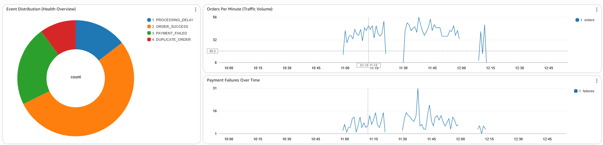
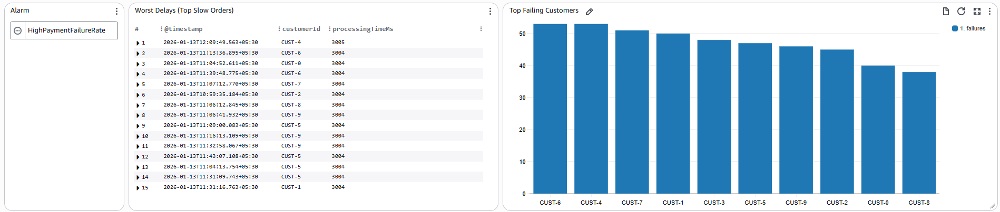
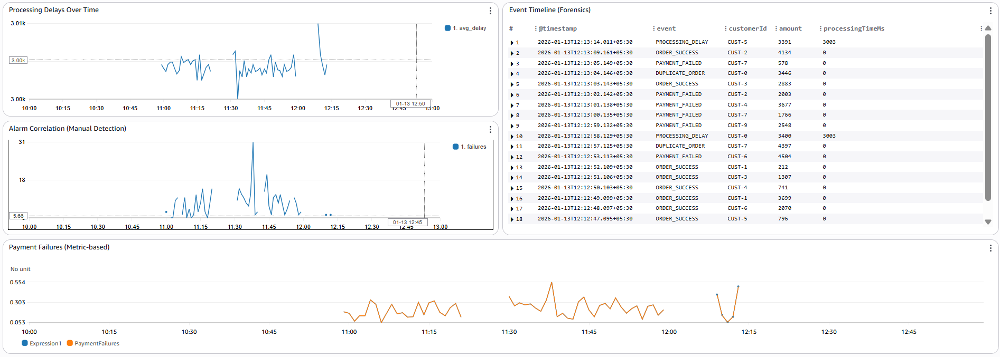

# 📊 Smart Order Log Processor – AWS Observability Project

## 📌 Project Overview

**Smart Order Log Processor** is a **log-driven background processing system** built to demonstrate **end-to-end observability on AWS** using **CloudWatch Logs and Monitoring features**.

The project focuses on **logs as the source of truth** and shows how logs can be:

* Collected
* Queried
* Analyzed
* Used for anomaly detection
* Converted into metrics
* Used to trigger real-time alerts

🚫 This is **not an API health check project**
✅ This is a **real DevOps / SRE-style observability system**

---

## 🧠 What the Application Does

* Runs as a **background worker**
* Simulates continuous **order processing**
* Randomly generates:

  * Successful orders
  * Payment failures
  * Delayed processing
  * Duplicate orders
* Emits **structured JSON logs**
* Runs continuously on **AWS EC2**
* Uses **CloudWatch Logs as the primary monitoring signal**

---

## 🏗️ High-Level Architecture

```
Node.js Worker (EC2)
   ↓
Structured JSON Logs
   ↓
CloudWatch Agent
   ↓
CloudWatch Logs
   ├─ Live Tail
   ├─ Logs Insights
   ├─ Contributor Insights
   ├─ Log Anomaly Detection
   ↓
Log Metric Filter
   ↓
Custom Metric (SmartOrders / PaymentFailures)
   ↓
CloudWatch Alarm
   ↓
SNS Topic
   ↓
Email Notification
```

---

## 🛠️ Tech Stack

### Application

* Node.js
* Shell scripts

### AWS Services

* EC2 (compute)
* IAM (users & roles)
* CloudWatch Logs
* CloudWatch Logs Insights
* CloudWatch Contributor Insights
* CloudWatch Log Anomaly Detection
* CloudWatch Metrics & Alarms
* SNS (email notifications)
* AWS Systems Manager (SSM – no SSH)

---

## 🗂️ Repository Structure

```
smart-order-log-processor/
├── worker.js              # Background order processor
├── run-worker.sh          # Local execution script
├── start-worker.sh        # EC2 execution script
├── package.json
├── package-lock.json
├── node_modules/
├── screenshots/
│   ├── 1.png
│   ├── 2.png
│   └── 3.png
└── README.md
```

---

## 📄 Sample Log Format (JSON)

```json
{
  "timestamp": "2026-01-12T07:11:52.386Z",
  "orderId": "ORD-e593fe",
  "customerId": "CUST-9",
  "event": "PAYMENT_FAILED",
  "amount": 391,
  "processingTimeMs": 0
}
```

Structured logs enable:

* Logs Insights queries
* Contributor Insights
* Anomaly Detection
* Metric Filters

---

# 🚀 Implementation – Phase by Phase

---

## 🟦 PHASE 0 — AWS & Local Foundations

### What was done

* Created IAM user for CLI access
* Configured AWS CLI locally
* Created EC2 IAM Role with:

  * CloudWatchAgentServerPolicy
  * AmazonSSMManagedInstanceCore

### Why

* Secure access (no root usage)
* Allow EC2 to push logs to CloudWatch
* Enable SSM access (no SSH keys)

---

## 🟦 PHASE 1 — Application Development (Local)

### What was done

* Built Node.js background worker
* Generated random order events
* Implemented structured JSON logging
* Added shell script for execution

### Why

* Logs are the primary signal
* Structured logs enable advanced CloudWatch features

---

## 🟦 PHASE 2 — GitHub Integration

### What was done

* Initialized Git repository
* Created `.gitignore`
* Added project documentation
* Pushed code to GitHub

### Why

* Source of truth
* Enables CI/CD or future automation

---

## 🟦 PHASE 3 — EC2 Setup

### What was done

* Launched Amazon Linux EC2 instance
* Attached IAM role
* Used **SSM Session Manager** (no SSH)
* Installed Node.js & Git

### Why

* Secure access
* Production-like environment
* Best practice EC2 management

---

## 🟦 PHASE 4 — CloudWatch Logs Integration

### What was done

* Installed CloudWatch Agent
* Configured log file monitoring
* Redirected application logs to `/var/log/smart-order.log`
* Verified logs in CloudWatch

### Why

* Centralized log management
* Foundation for all observability features

---

## 🟦 PHASE 5 — Live Tail & Logs Insights

### Live Tail

* Viewed logs in real time
* Debugged system behavior live

### Logs Insights

* Queried logs using SQL-like syntax
* Analyzed:

  * Failed payments
  * Slow orders
  * Recent events
  * Failure trends

### Why

* Real-time debugging
* Post-incident analysis

---

## 🟦 PHASE 5A — Deep Dive: CloudWatch Logs Insights (Querying, Patterns & Visualization)

This phase focuses on **interactive log analysis** using **CloudWatch Logs Insights**, treating logs as the primary source of truth for system behavior.

---

### 🟦 Accessing Logs Insights

**AWS Console Path:**

```
CloudWatch → Logs → Logs Insights
```

**Configuration:**

* Log group: `/smart-orders/processor`
* Time range: Last 15 minutes (adjustable)

---

### 🟦 Basic Log Exploration (Sanity Check)

```sql
fields @timestamp, event, customerId, amount, processingTimeMs
| sort @timestamp desc
| limit 20
```

**Outcome:**

* Confirmed real-time log ingestion
* Verified JSON structure
* Used for quick debugging

---

### 🟦 Filtering Specific Events (Payment Failures)

```sql
fields @timestamp, customerId, amount
| filter event = "PAYMENT_FAILED"
| sort @timestamp desc
```

**Use case:**

* Investigate recent failures
* Correlate with alarms and incidents

---

### 🟦 Event Distribution Analysis

```sql
stats count() by event
```

**Visualization:** Pie / Donut chart
**Insights gained:** Success vs failure ratios and system health snapshot

---

### 🟦 Failure Trends Over Time

```sql
filter event = "PAYMENT_FAILED"
| stats count() as failures by bin(1m)
```

**Visualization:** Line chart
**Why:** Spike detection and incident correlation

---

### 🟦 Order Volume Over Time

```sql
stats count() as orders by bin(1m)
```

**Visualization:** Line chart
**Insight:** Traffic bursts vs failures

---

### 🟦 Identifying Noisy Customers

```sql
filter event = "PAYMENT_FAILED"
| stats count() as failures by customerId
| sort failures desc
| limit 10
```

**Visualization:** Bar chart
**Why:** Root cause analysis and abuse detection

---

### 🟦 Performance Analysis (Latency)

```sql
filter processingTimeMs > 2000
| stats avg(processingTimeMs) as avg_delay by bin(1m)
```

**Outcome:** Detected latency spikes preceding failures

---

### 🟦 Worst-Case Performance

```sql
fields @timestamp, customerId, processingTimeMs
| filter processingTimeMs > 3000
| sort processingTimeMs desc
| limit 10
```

**Use case:** Incident forensics

---

### 🟦 Failure Threshold Validation

```sql
filter event = "PAYMENT_FAILED"
| stats count() as failures by bin(1m)
| filter failures >= 5
```

**Outcome:** Verified alarm accuracy

---

### 🟦 Failure Rate Analysis

```sql
stats 
  count(*) as total,
  sum(if(event = "PAYMENT_FAILED", 1, 0)) as failed
by bin(1m)
| fields bin(1m), (failed * 100.0) / total as failure_rate
```

**Visualization:** Line chart
**Why:** SLO-style monitoring

---

### 🟦 Dashboard Integration

Logs Insights queries were added as **dashboard widgets**, creating a **unified observability dashboard** combining logs, metrics, alarms, and SLO indicators.

---

## 📸 CloudWatch Observability Dashboard (Screenshots)

The following screenshots show the **single unified CloudWatch dashboard** built from Logs Insights queries, metrics, and alarms.

### Dashboard Overview – System Health & Traffic



### Incident Detection & Customer Impact



### Performance, Correlation & Forensics



These dashboards enable:

* Real-time system visibility
* Fast incident triage
* Historical trend analysis
* SLO-style monitoring from logs alone

---

## 🟦 PHASE 6 — Contributor Insights

* Grouped failures by `customerId`
* Identified top contributors to errors
* Reduced MTTR during incidents

---

## 🟦 PHASE 7 — Log Anomaly Detection

* Enabled ML-based anomaly detection
* Learned baseline behavior
* Detected abnormal failure spikes automatically

---

## 🟦 PHASE 8 — Log Metric Filters & Alarms

* Created metric from logs:
  `SmartOrders / PaymentFailures`
* Alarm triggers if ≥ 5 failures / minute
* SNS email notification verified

---

## 🟦 PHASE 9 — Log Management & Cost Control

* Log retention set to **7 days**
* Prevented uncontrolled cost growth

---

## 🟦 PHASE 10 — Finalization & Documentation

* Resume-ready documentation
* Interview-ready narrative
* Production-grade observability story

---

## 🎯 Resume-Ready Summary

> Built a production-grade AWS observability pipeline using CloudWatch Logs, Logs Insights, Contributor Insights, anomaly detection, metric filters, and alarms to monitor a log-driven order processing system with real-time SNS alerts.

---

## 🧪 How to Run Locally

```bash
npm install
chmod +x run-worker.sh
./run-worker.sh
```

---

## 🧠 Key Learning Outcome

Logs can **drive monitoring**, **generate metrics**, and **power alerts** — exactly how real DevOps and SRE teams operate.

---

## 🏁 Final Status

✅ All phases completed
✅ All CloudWatch features exercised
✅ Alerts verified
✅ Production-ready observability setup